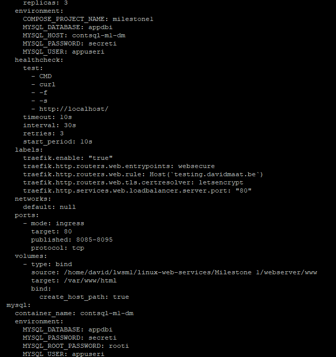
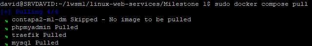
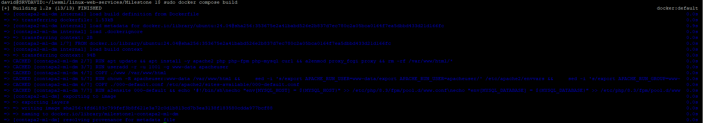
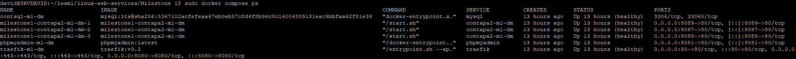
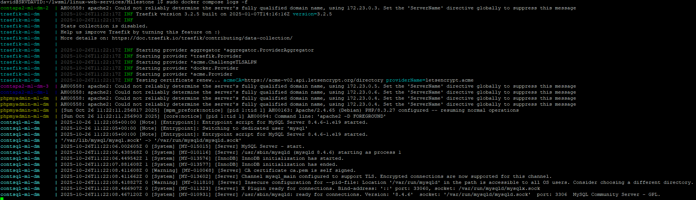
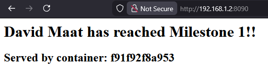
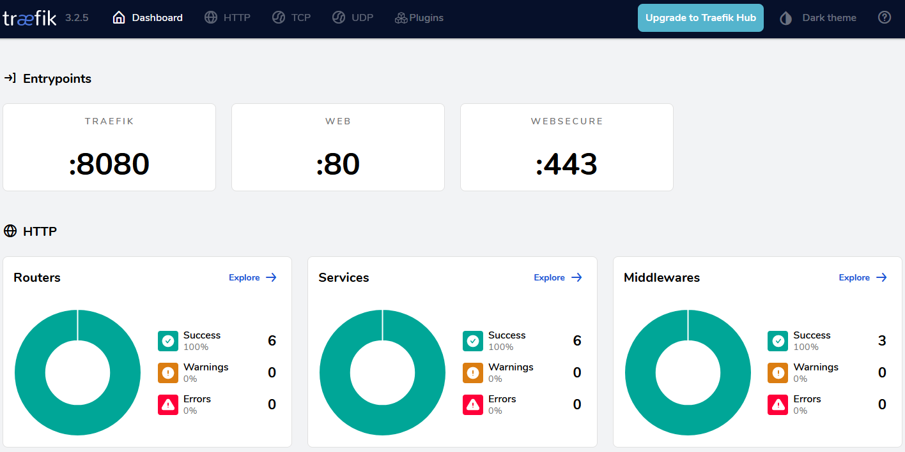
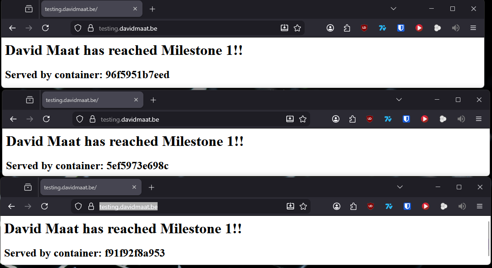

# Milestone 1 - Docker Compose Stack Documentation

## Table of Contents
1. [Overview](#overview)
2. [Architecture](#architecture)
3. [Prerequisites](#prerequisites)
4. [Project Structure](#project-structure)
5. [Configuration Files](#configuration-files)
6. [Environment Variables](#environment-variables)
7. [Step-by-Step Deployment Guide](#step-by-step-deployment-guide)
8. [Service Descriptions](#service-descriptions)
9. [Verification and Testing](#verification-and-testing)

---

## Overview

This Docker Compose stack creates a scalable web application infrastructure with the following components:

- **Traefik**: Reverse proxy with automatic HTTPS/SSL certificate management
- **Web Servers (Apache/PHP)**: Three replicas of Apache web servers with PHP-FPM support
- **MySQL Database**: Persistent database backend
- **phpMyAdmin**: Web-based database administration tool

The stack demonstrates:
- Load balancing across multiple web server instances
- Automatic SSL certificate provisioning via Let's Encrypt
- Container health monitoring
- Service dependencies and startup ordering
- Persistent data storage

---

## Architecture

```
                    Internet
                       ↓
                  Traefik (Reverse Proxy)
                  Port 443 (HTTPS)
                  Port 80 (HTTP → redirects to HTTPS)
                  Port 8080 (Dashboard)
                       ↓
          ┌────────────┴────────────┐
          ↓                         ↓
    Web Servers (×3)          phpMyAdmin
    Ports 8085-8095           Port 8081
    (Load Balanced)
          ↓
       MySQL Database
    (Internal Network)
```

---

## Prerequisites

Before deploying this stack, ensure you have:

1. **Docker Engine**
   - Check version: `docker --version`
   
2. **Docker Compose**
   - Check version: `docker compose version`

3. **Operating System**: 
   - Linux (recommended for production)
   - Windows with WSL2 or Docker Desktop
   - macOS with Docker Desktop

4. **Domain Name** (for production with real SSL certificates)
   - DNS properly configured to point to your server's IP

5. **Network Requirements**:
   - Ports 80, 443, 8080, 8085-8095, 8081 available
   - Internet connection for pulling images and obtaining SSL certificates

---

## Project Structure

```
Milestone 1/
├── docker-compose.yml          # Main orchestration file
├── .env.example                # Copy to .env and fill in for production
├── webserver/                  # Web server configuration
│   ├── Dockerfile              # Custom Apache/PHP image
│   ├── 000-default.conf        # Apache VirtualHost configuration
│   ├── init.sql                # Database initialization script
│   └── www/                    # Web application files
│       └── index.php           # Main application file
```

---

## Configuration Files

### docker-compose.yml

The main orchestration file that defines all services, networks, and volumes.

**Key sections explained:**
- `services`: Defines each container/service
- `volumes`: Named volumes for persistent data
- `depends_on`: Service startup dependencies
- `healthcheck`: Container health monitoring
- `labels`: Traefik routing configuration

### Dockerfile

Custom image based on Ubuntu 24.04 with:
- Apache web server
- PHP 8.3 with FPM (FastCGI Process Manager)
- MySQL PHP extension
- Security hardening (non-root user)

### 000-default.conf

Apache VirtualHost configuration that:
- Sets up document root at `/var/www/html`
- Configures PHP-FPM integration via Unix socket
- Enables directory permissions

### init.sql

Database initialization script that:
- Creates a `users` table
- Inserts sample data

### index.php

PHP application that:
- Connects to MySQL database
- Displays user data
- Shows which container is serving the request (for load balancing verification)

---

## Environment Variables

Copy `.env.example` to `.env` in the `Milestone 1/` directory with the following variables:

```env
# Email for Let's Encrypt notifications
EMAIL=your-email@example.com

# Domain name for your application
DOMAIN=yourdomain.com

# ACME Server (use staging for testing)
# Staging: https://acme-staging-v02.api.letsencrypt.org/directory
# Production: https://acme-v02.api.letsencrypt.org/directory
ACME_SERVER=https://acme-staging-v02.api.letsencrypt.org/directory

# MySQL Configuration
MYSQL_ROOT_PASSWORD=secure_root_password_here
MYSQL_DATABASE=milestone_db
MYSQL_USER=milestone_user
MYSQL_PASSWORD=secure_user_password_here
```

**Parameter Explanations:**

| Variable | Description | Example |
|----------|-------------|---------|
| `EMAIL` | Email address for Let's Encrypt certificate notifications | `admin@example.com` |
| `DOMAIN` | Your domain name for the web application | `example.com` or `www.example.com` |
| `ACME_SERVER` | Let's Encrypt API endpoint (staging or production) | Use staging for testing |
| `MYSQL_ROOT_PASSWORD` | MySQL root user password (keep secure!) | Strong password with special chars |
| `MYSQL_DATABASE` | Name of the database to create | `milestone_db` |
| `MYSQL_USER` | MySQL user for the application | `milestone_user` |
| `MYSQL_PASSWORD` | Password for the MySQL user | Strong password |

---

## Step-by-Step Deployment Guide

### Step 1: Clone or Navigate to Project Directory

```powershell
cd ~\"Milestone 1"
```

**Explanation**: Navigate to the directory containing the `docker-compose.yml` file.

---

### Step 2: Create Environment File

Create a `.env` file with your configuration:

```powershell
cp .env.example .env && vim .env
```

**Explanation**: This opens vim to create the environment file. Fill in the environment variables from the [Environment Variables](#environment-variables) section and save.

**Screenshot**:


---

### Step 3: Validate Docker Compose Configuration

```powershell
docker compose config
```

**Explanation**: This command validates the syntax of your `docker-compose.yml` file and shows the merged configuration with environment variables substituted.

**What to look for:**
- No error messages
- Environment variables properly substituted
- All services listed correctly

**Partial screenshot**: 

---

### Step 4: Pull Required Docker Images

```powershell
docker compose pull
```

**Explanation**: Downloads all required Docker images before building. This separates the download process from the build process.

**Images pulled:**
- `traefik:v3.2` (Reverse proxy)
- `mysql:lts` (Database)
- `phpmyadmin:latest` (Database admin tool, latest is okay here, since it's not exposed publicly)
- `ubuntu:24.04` (Base image for custom web server)

**Screenshot**: 

---

### Step 5: Build Custom Images

```powershell
docker compose build
```

**Explanation**: Builds the custom web server image defined in `webserver/Dockerfile`. This includes:
- Installing Apache and PHP
- Configuring PHP-FPM
- Setting up a non-root user for security
- Copying application files

**Parameters in Dockerfile explained:**

| Instruction | Purpose |
|-------------|---------|
| `FROM ubuntu:24.04@sha256:...` | Base image with specific digest for reproducibility |
| `RUN apt update && apt install...` | Install Apache, PHP, and required extensions |
| `RUN useradd -r -u 1001...` | Create non-root user for running Apache (security best practice) |
| `COPY ./www /var/www/html` | Copy application files into the image |
| `RUN chown -R apacheuser:www-data...` | Set proper file permissions |
| `EXPOSE 80` | Document that container listens on port 80 |
| `CMD ["/start.sh"]` | Default command to run when container starts |

**Screenshot**: 

---

### Step 6: Start the Stack

```powershell
docker compose up -d
```

**Explanation**: Starts all services in detached mode (runs in background).

**Flags explained:**
- `-d` or `--detach`: Run containers in the background

**What happens:**
1. Creates a custom Docker network for the services
2. Creates named volumes for persistent data
3. Starts MySQL container first (dependency)
4. Waits for MySQL health check to pass
5. Starts web server containers (3 replicas)
6. Starts phpMyAdmin
7. Starts Traefik reverse proxy

**Screenshot**: 

---

### Step 7: Monitor Container Status

```powershell
docker compose ps
```

**Explanation**: Shows the status of all containers in the stack.

**Status indicators:**
- `Up (healthy)`: Container is running and passed health checks
- `Up (health: starting)`: Container is running but health check hasn't passed yet
- `Exit`: Container has stopped

**Screenshot**: 

---

### Step 8: View Container Logs

Check logs for all services:
```powershell
docker compose logs
```

Check logs for a specific service:
```powershell
docker compose logs traefik
```

Follow logs in real-time:
```powershell
docker compose logs -f contapa2-m1-dm
```

**Flags explained:**
- `-f` or `--follow`: Stream logs in real-time (like `tail -f`)
- `--tail=100`: Show only last 100 lines
- `--timestamps`: Add timestamps to log entries

**Screenshot**: 

## Service Descriptions

### 1. Traefik (Reverse Proxy)

**Image**: `traefik:v3.2`

**Purpose**: Acts as a reverse proxy and load balancer with automatic HTTPS certificate management.

**Ports Exposed:**
- `80`: HTTP entry point (redirects to HTTPS)
- `443`: HTTPS entry point
- `8080`: Traefik dashboard (insecure mode for development)

**Command-line Parameters Explained:**

| Parameter | Explanation |
|-----------|-------------|
| `--api.dashboard=true` | Enable the Traefik web dashboard |
| `--api.insecure=true` | Allow dashboard access without authentication (dev only) |
| `--ping=true` | Enable ping endpoint for health checks |
| `--entrypoints.web.address=:80` | Create HTTP entry point on port 80 |
| `--entrypoints.web.http.redirections.entrypoint.to=websecure` | Redirect HTTP to HTTPS |
| `--entrypoints.web.http.redirections.entrypoint.scheme=https` | Use HTTPS scheme for redirects |
| `--entrypoints.web.http.redirections.entrypoint.permanent=true` | Use HTTP 301 (permanent redirect) |
| `--entrypoints.websecure.address=:443` | Create HTTPS entry point on port 443 |
| `--certificatesresolvers.letsencrypt.acme.email=${EMAIL}` | Email for Let's Encrypt notifications |
| `--certificatesresolvers.letsencrypt.acme.storage=/letsencrypt/acme.json` | Where to store certificates |
| `--certificatesresolvers.letsencrypt.acme.caserver=${ACME_SERVER}` | Let's Encrypt server (staging/prod) |
| `--certificatesresolvers.letsencrypt.acme.httpchallenge.entrypoint=web` | Use HTTP-01 challenge on port 80 |
| `--providers.docker=true` | Enable Docker provider |
| `--providers.docker.endpoint=unix:///var/run/docker.sock` | Docker socket location |
| `--providers.docker.exposedbydefault=false` | Require explicit `traefik.enable=true` label |
| `--log.level=INFO` | Set logging verbosity |

**Volumes:**
- `/var/run/docker.sock:/var/run/docker.sock:ro`: Docker socket (read-only) for service discovery
- `traefik-certs:/letsencrypt`: Persistent storage for SSL certificates

**Health Check:**
```yaml
test: ["CMD", "traefik", "healthcheck", "--ping"]
interval: 5s      # Check every 5 seconds
timeout: 3s       # Fail if check takes > 3 seconds
retries: 3        # Retry 3 times before marking unhealthy
start_period: 5s  # Grace period before starting checks
```

**Dependencies:**
- Depends on `contapa2-m1-dm` being healthy before starting

---

### 2. Web Server (contapa2-m1-dm)

**Build Context**: `./webserver/Dockerfile`

**Purpose**: Apache web server with PHP-FPM serving the application.

**Ports Exposed:**
- `8085-8095:80`: Maps host ports 8085-8095 to container port 80 for 3 replicas

**Deployment:**
```yaml
deploy:
  replicas: 3  # Run 3 instances (by default) of this service
```

**Explanation**: Docker Compose will start 3 containers from this service definition. Each gets a unique name (contapa2-m1-dm-1, contapa2-m1-dm-2, contapa2-m1-dm-3).

**Environment Variables:**

| Variable | Purpose | Value Source |
|----------|---------|--------------|
| `MYSQL_HOST` | Database hostname | Hardcoded: `contsql-m1-dm` |
| `MYSQL_DATABASE` | Database name | From `.env` file |
| `MYSQL_USER` | Database username | From `.env` file |
| `MYSQL_PASSWORD` | Database password | From `.env` file |

**Volumes:**
- `./webserver/www:/var/www/html`: Bind mount for live code updates (development)

**Traefik Labels:**

| Label | Explanation |
|-------|-------------|
| `traefik.enable=true` | Enable Traefik routing for this service |
| ``traefik.http.routers.web.rule=Host(`${DOMAIN}`)``| Route requests matching this domain |
| `traefik.http.routers.web.entrypoints=websecure` | Use HTTPS entry point |
| `traefik.http.routers.web.tls.certresolver=letsencrypt` | Use Let's Encrypt for SSL |
| `traefik.http.services.web.loadbalancer.server.port=80` | Backend container port |

**Health Check:**
```yaml
test: ["CMD", "curl", "-f", "-s", "http://localhost/"]
interval: 30s     # Check every 30 seconds
timeout: 10s      # Fail if check takes > 10 seconds
retries: 3        # Retry 3 times before marking unhealthy
start_period: 10s # Wait 10s before starting checks
```

**Explanation**: Uses `curl` to test if the web server responds on port 80.

**Dependencies:**
- Depends on `mysql` being healthy before starting

---

### 3. MySQL Database

**Image**: `mysql:lts@sha256:5367102acfefeaa47eb0eb57c8d4f8b96c8c14004859131eac9bbfaa62f81e34`

**Purpose**: Persistent relational database backend.

**Image Digest Explanation:**
- Using `@sha256:...` pins the exact image version for reproducibility
- `lts` tag points to Long Term Support version of MySQL

**Container Name**: `contsql-m1-dm`

**Restart Policy**: `always` - Container restarts automatically if it stops

**Environment Variables:**

| Variable | Purpose |
|----------|---------|
| `MYSQL_ROOT_PASSWORD` | Password for MySQL root user |
| `MYSQL_DATABASE` | Database to create on initialization |
| `MYSQL_USER` | Non-root user to create |
| `MYSQL_PASSWORD` | Password for the non-root user |

**Health Check:**
```yaml
test: ["CMD-SHELL", "mysqladmin ping -h localhost -u${MYSQL_USER} -p${MYSQL_ROOT_PASSWORD} || exit 1"]
interval: 10s      # Check every 10 seconds
timeout: 5s        # Fail if check takes > 5 seconds
retries: 5         # Retry 5 times before marking unhealthy
start_period: 30s  # Wait 30s before starting (MySQL needs time to initialize)
```

**Explanation**: Uses `mysqladmin ping` to verify MySQL is accepting connections.

**Volumes:**

| Volume | Purpose |
|--------|---------|
| `db_data:/var/lib/mysql` | Persistent storage for database files |
| `./webserver/init.sql:/docker-entrypoint-initdb.d/init.sql` | Initialization script |

**Initialization Process:**
1. MySQL container starts
2. Creates database specified in `MYSQL_DATABASE`
3. Creates user specified in `MYSQL_USER`
4. Runs all `.sql` files in `/docker-entrypoint-initdb.d/`
5. Sets root password

---

### 4. phpMyAdmin

**Image**: `phpmyadmin:latest`

**Purpose**: Web-based database administration interface.

**Container Name**: `phpmyadmin-m1-dm`

**Ports Exposed:**
- `8081:80`: Access phpMyAdmin at http://localhost:8081

**Environment Variables:**

| Variable | Value | Purpose |
|----------|-------|---------|
| `PMA_HOST` | `mysql` | Hostname of MySQL server to connect to |

**Explanation**: `PMA_HOST` uses Docker's internal DNS to resolve the MySQL service name to its IP address.

**Restart Policy**: `always` - Ensures phpMyAdmin is always available

---

## Verification and Testing

### 1. Access Traefik Dashboard

Open your browser and navigate to:
```
http://SERVER_IP:8080
```

**What to check:**
- HTTP routers are configured
- All backend servers are listed
- Health status is green

**Screenshot**: 

---

### 2. Access Web Application (Local)

Test direct access to individual web server replicas:

```
http://SERVER_IP:assigned_port
http://SERVER_IP:assigned_port
http://SERVER_IP:assigned_port
```

**Note**: Ports 8085-8095 are available for up to 11 replicas.

**Expected Result:**
- Page displays "David Maat has reached Milestone 1!!"
- Shows container hostname (different for each port)

**Screenshot**: 

### 3. Test Load Balancing
Access the domain 

Refresh the page multiple times and observe the "Served by container" hostname changing between:
- `contapa2-m1-dm-1`
- `contapa2-m1-dm-2`
- `contapa2-m1-dm-3`

**Explanation**: Traefik distributes requests across all healthy backend servers.

**Screenshot**: 

---

### 4. Access phpMyAdmin

Navigate to:
```
http://SERVER_IP:8081
```

**Login credentials:**
- **Server**: `contsql-m1-dm`
- **Username**: Value from `MYSQL_USER` in .env
- **Password**: Value from `MYSQL_PASSWORD` in .env

**What to check:**
- Database `milestone_db` exists
- Table `users` contains "David Maat"

**Screenshot**: 

## Additional Resources

### Docker Documentation
- [Docker Compose Reference](https://docs.docker.com/compose/compose-file/)
- [Docker Networking](https://docs.docker.com/network/)
- [Docker Volumes](https://docs.docker.com/storage/volumes/)

### Traefik Documentation
- [Traefik Official Docs](https://doc.traefik.io/traefik/)
- [Let's Encrypt Integration](https://doc.traefik.io/traefik/https/acme/)
- [Docker Provider](https://doc.traefik.io/traefik/providers/docker/)

### MySQL Documentation
- [MySQL Docker Image](https://hub.docker.com/_/mysql)
- [MySQL Configuration](https://dev.mysql.com/doc/)

### PHP Documentation
- [PHP-FPM Configuration](https://www.php.net/manual/en/install.fpm.php)
- [PHP MySQL Extension](https://www.php.net/manual/en/book.mysqli.php)

---

## Conclusion

This Docker Compose stack demonstrates a production-ready architecture with:
-  Load balancing across multiple web servers
-  Automatic SSL certificate management
-  Health monitoring and automatic recovery
-  Persistent data storage
-  Service isolation and dependency management
-  Scalability (easily adjust replica count)

For questions or issues, refer to the troubleshooting section or consult the official documentation linked above.

---

**Document Version**: 1.0  
**Last Updated**: October 26, 2025  
**Author**: David Maat  
**Project**: Linux Web Services - Milestone 1

---

## Link to proof 
[https://youtu.be/K4Ahl6TJ738](https://youtu.be/K4Ahl6TJ738)